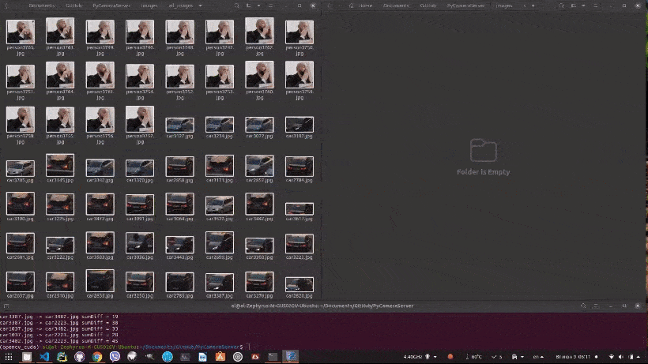
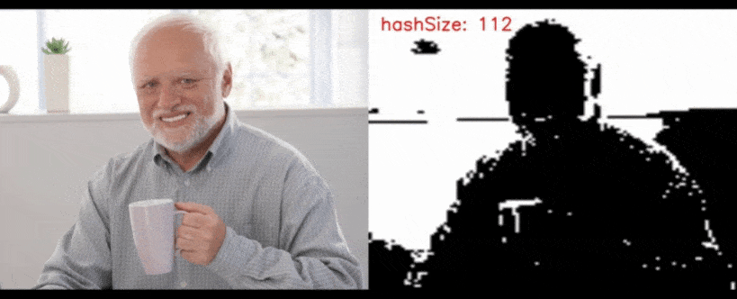
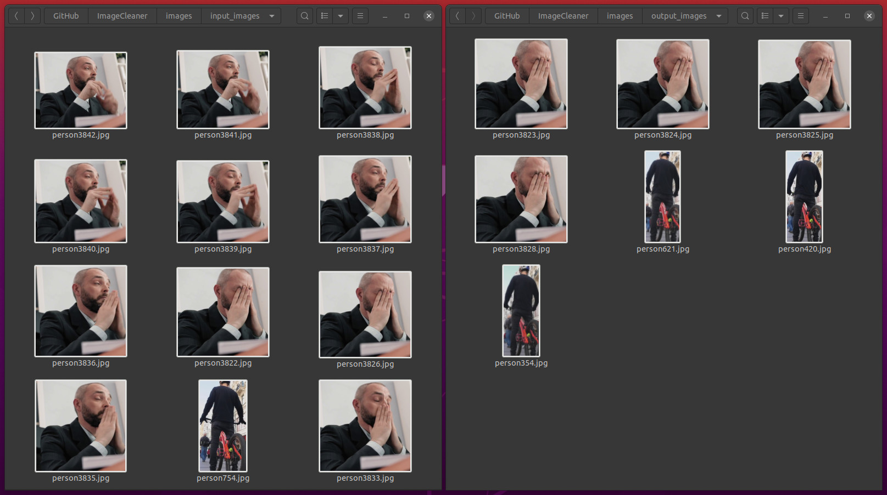

# ImageCleaner
Cleans similar or dublicate images from folder using perceptual image hashing with live preview

## How it works
[Perceptual hashing](https://en.wikipedia.org/wiki/Perceptual_hashing#:~:text=Perceptual%20hashing%20is%20the%20use,drastic%20change%20in%20output%20value)

#### Script detects similar images based on simple algorithm:
- Reducing size of each image to NxN pixels (set by user)
- Converting to grayscale
- Calculating the mean of all color values
- Creating new image (hash) based on mean value. Setting color of each pixel to black if value of NxN matrix is above mean, and to white if greater
- [Hamming distance](https://en.wikipedia.org/wiki/Hamming_distance): comparing hashes with each other and count the number of different pixels
- The image is considered similar and moved from folder if that number is less than threshold set by user

## How to run

Tested with Python 3.8.2, OpenCV 4.3.0, Ubuntu 20.04 LTS

Folder `input_images` contains 11 objects in 186 image variations created by YOLO neural detector from video

This example will leave all unique 11 objects in folder, other will be moved to `output_images`: 

`python image_hash.py -i images/input_images -o images/output_images -s 16 -t 33`

Args:

`-i`: input path to scan

`-o`: output path to move similar images

`-s`: hash size (default=32)

`-t`: threshold percent value for detection from 0 to 100, where 0 is absolute similarity of hashes (only nearly identical images will be moved)

Note: both hash size and threshold values affect on detection quality

### Similar images search:

### Moving similar images to another folder (right column) leaving only unique (left column):

### Hash generation:

### Similarity threshold (t = 2%)  (moved 7 nearly identical images)

### Similarity threshold (t = 33%) (only unique objects remained, 175 similar images moved)

